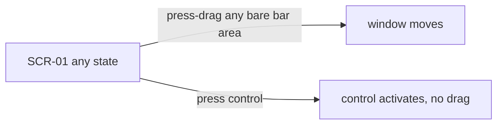

# My Translator — UI/UX Design Spec (ui-restyle)

> Gate 1 record: mode=codebase | decision=restyle-in-place | scope=all screens |
> non-goals=none hard; user pain point: **header too crowded to drag the window**
> (user frequently repositions the always-on-top overlay) | date=2026-08-27

## 1. Product Context

Windows-only Tauri 2 desktop utility, vanilla JS. Realtime speech translation
overlay (Soniox STT) for meetings/videos; ~1000 users, v0.7.0. 680×400 (min
600×200) undecorated always-on-top window, dark "Quiet Glass" theme with
AA-verified contrast at every opacity 20–100%. Constraint: restyle in place —
information architecture, features, and the verified contrast system are kept.

## 2. Information Architecture

Single window, three mutually-exclusive views + modal/toast layer (see
[screens.md](./screens.md) flow graph): SCR-01 Main Overlay (hub) ↔ SCR-02
Settings, SCR-01 ↔ SCR-03 Sessions List → SCR-04 Session Viewer; SCR-05
Recovery modal (boot-time), SCR-06 Toast. No change to this model (restyle).

## 3. User Flows

Unchanged from current app; canonical edges + edge cases (empty/loading/error
states per screen) are recorded in [screens.md](./screens.md). The one flow
this restyle materially touches:

**Flow: reposition the window (the Gate 1 pain point)**

Requirement: ≥ `--drag-bar-min-gap` (48px) of continuous bare, drag-enabled bar
must exist at min window width 600px, in every state including recording.

## 4. Screen Specs

See [screens.md](./screens.md) — anchor-verified inventory frozen at `728f8b2`.

## 5. Design System

Machine source: [tokens.css](./tokens.css). Restyle keeps the entire Quiet
Glass token set (colors, text opacities, surfaces, radii, spacing, type,
motion) **unchanged** — contrast ratios are field-verified and a standing
project rule. Newly proposed tokens only:

| Token | Value | Usage |
|---|---|---|
| `--cluster-bg` | rgba(30,32,46,.85) | header pill-cluster background |
| `--cluster-border` | rgba(255,255,255,.10) | pill-cluster border |
| `--cluster-radius` | 999px | pill shape |
| `--cluster-gap` / `--cluster-pad` | 2px / 3px | intra-pill layout |
| `--drag-bar-min-gap` | 48px | guaranteed bare drag width |
| `--menu-bg/border/radius/shadow` | see tokens.css | overflow + source dropdown menus |
| `--menu-item-h` | 30px | menu row height |
| `--z-menu` | 500 | menus above floating, below modal |
| `--accent-strong` | #4a63a8 | fill for accent-filled buttons (audit: white text on `--accent` is ~2.9:1; this lifts it ≥4.5:1). Hover keeps the fill and adds an `--accent-hover` ring |

### Header redesign (the core of the restyle)

Current: 13 fixed-size controls in 5 zones fill the whole 42px bar; the only
drag surface (status area) collapses at 680px. New composition (Google
Meet/Discord call-bar pattern — controls grouped into floating pills, bar
ground left bare and fully drag-enabled):

```
| [⚙]  [▶/⏹ | 🎙▾ | TTS]  ······ ● status 00:00 ······  [🗂 | ⋯]  [◱ 📌 − ×] |
   pill A      pill B          bare drag ground           pill C    pill D
```

- **Pill B (transport):** start/stop stays primary (red + pulse when
  recording, isolated emphasis like Meet's end-call); the 3 source buttons
  (system/mic/both) collapse into one **split-button 🎙▾** opening a 3-item
  menu (Meet's mic-device chevron pattern); TTS toggle stays.
- **Pill C (library):** sessions button + **⋯ overflow menu** holding copy,
  export, clear (Tana/Perplexity pattern). Clear keeps danger styling inside
  the menu, separated by a divider.
- **Pill D (window):** compact, pin, minimize, close — unchanged positions,
  close keeps red hover.
- **Ground:** `#drag-region` background is bare and drag-enabled everywhere,
  including between/around pills; status dot+text+timer render inert
  (pointer-events: none) on the drag ground, so the entire center is
  draggable. Visible control count 13 → 8.
- Keyboard shortcuts unchanged (⌘1/2/3 still switch source; menu is the
  pointer path).

### Components (restyle deltas only)

- **Icon buttons:** current 28–32px heights kept; inside pills they lose
  individual borders (pill provides the boundary), hover = `--bg-hover` fill.
- **Menus (new):** `--menu-bg` panel, `--radius-md`, `--menu-shadow`, rows
  `--menu-item-h`, icon + label + shortcut hint; opens 150ms ease-out
  scale/fade from trigger; Esc/blur closes.
- **All other components** (cards, inputs, tabs, sliders, toasts, modal):
  styling unchanged; mockups re-express them with the shared tokens.

### From ak-ui-ux-pro-max (accepted)

Inter as the single UI face (already the app font) · OLED-dark minimal-glow
effects (existing `--accent-glow` pattern) · visible focus ring on every
control (existing `--border-focus`, SC 1.4.11 verified) ·
`prefers-reduced-motion` honored for pulse/wave/menu animations · SVG icons
only, one stroke family (app already uses inline SVG).

## 6. Interaction & Motion

- Motion tokens kept: 150ms fast / 250ms normal, cubic-bezier(0.4,0,0.2,1);
  menus enter 150ms ease-out, exit ~100ms; no layout-shifting animations.
- Press feedback within 100ms (`--bg-active`); recording pulse kept but
  disabled under `prefers-reduced-motion`.
- Drag affordance: cursor stays default on bare bar (Tauri handles drag);
  controls get `cursor: pointer` — the pointer/default cursor split is itself
  the affordance boundary.
- A11y baseline (kept + extended to new menus): aria-labels on icon buttons,
  `role="menu"/"menuitem"`, focus trap while open, tab order = visual order,
  4.5:1 text / 3:1 UI-glyph contrast on all new surfaces.
- Implementation notes from the guidelines audit (mockups annotate these; the
  app must wire them): status text and toast injection points use
  `role="status"`/`role="alert"`; settings tabs link `aria-controls` ↔
  `aria-labelledby`; menu triggers pair `aria-expanded` with `aria-controls`;
  inputs get meaningful `name` attributes; compact mode's 6px hover strip is
  pointer-only — the Ctrl+D toggle is the required keyboard path; all shortcut
  hints render Ctrl (Windows), not ⌘.

## 7. References

Mobbin (primary — pattern authority where conflicts arise):

- [Google Meet call bar](https://mobbin.com/screens/f539eb8d-a302-4d39-ada1-edc97c4806b8) — grouped control clusters + chevron sub-menu on mic + isolated danger CTA → header pills + source split-button.
- [Discord call bar](https://mobbin.com/screens/4857c357-f523-4674-acbc-0c8003d58ea4) — floating pill clusters on bare dark ground → drag-ground/pill figure-ground split.
- [Mercor interview bar](https://mobbin.com/screens/1e695652-92c2-4b74-b4f5-6f850c52c646) — minimal 3-control bar, everything else empty → "bar ground is negative space" principle.
- [pillowtalk transcribe](https://mobbin.com/screens/8f395911-28da-47f4-a446-97b72958d3b8) — dark transcription screen, content dominates, chrome minimal → SCR-01 listening/transcript states.
- [X Spaces REC pill](https://mobbin.com/screens/cab357a7-8697-4599-9be5-57e7443b24d6) — status as compact "● REC" pill → status rendering on drag ground.
- [Proton Pass settings](https://mobbin.com/screens/a16fdbaa-de05-42ed-b08a-4e5321be0167) — dark tabbed settings with card-grouped sections → SCR-02.
- [Uxcel settings tabs](https://mobbin.com/screens/9fe311f7-0fe1-4ba9-95f9-2907431ed012) — pill tab row + single column → SCR-02 tab bar.
- [Hotjar recordings list](https://mobbin.com/screens/ce70148d-a7f8-4ab0-ac37-aa76c475ae81) — compact rows, right-aligned duration → SCR-03.
- [Amplitude session replays](https://mobbin.com/screens/5d88aff8-9e01-4b29-b1f1-f6654e491766) — time/length columns → SCR-03 metadata alignment.
- [Otter transcript + AI chat](https://mobbin.com/screens/01981d27-dce2-4dce-a344-3cb6185da831) — summary/transcript + side AI panel with ask input → SCR-04.
- [Fireflies AskFred](https://mobbin.com/screens/d04f2c04-db7a-49d1-a0ed-e69fe8fc7f1b) — transcript search + AI Q&A tab → SCR-04 Q&A.
- [Tana ⋯ menu](https://mobbin.com/screens/d1f5b0a9-80b1-49f0-88c6-cceb833fe0a7), [Perplexity ⋯ export menu](https://mobbin.com/screens/459c7974-51db-4678-b855-ea1ecdb7ebf4) — overflow menus with export actions → header ⋯ + SCR-04 export.

ak-ui-ux-pro-max: accepted items in §5; **rejected** (landing-page skew):
"Video-First Hero" pattern, light `#F8FAFC` background, orange `#F97316` CTA,
blue `#2563EB` primary (would replace the verified Quiet Glass accent system).

## 8. Open Questions

1. Body sizes 11–12px sit below the guideline's 12px floor. Deliberate for a
   compact overlay; enlarging would shrink transcript space. Keep? (default:
   keep)
2. Source split-button hides system/mic/both one click deeper for pointer
   users (shortcuts unchanged). Acceptable trade for drag space? (default:
   yes — validated at Gate 3 pilot)
3. Sessions button could also fold into ⋯ (7 visible controls, more drag
   room). Kept visible for now — one-click access to a primary feature.
4. Audit computed `--border-focus` (0.55 alpha) at ~2.8:1 against the base
   ground, below the 3:1 non-text minimum — but the project previously
   field-verified the focus ring against SC 1.4.11 on every surface. Conflict
   unresolved; token left unchanged pending a re-measure in the live app
   (raising alpha to ≥0.8 is the fix if the audit number holds).
