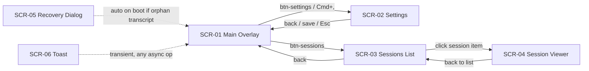

# My Translator — Screen Inventory

> mode=codebase | frozen-at=728f8b2c2b94240f9102f8f81e66d8307a2f3908 |
> verified=2026-08-27 (anchor spot-check ✓, adversarial route-diff ✓ 0 mismatches, reachability ✓) |
> scope=all | **code-only, unverified visuals** (app not run during scout)

Gate 1 scope: **restyle in place**, all screens, no hard non-goals.
Key user pain point: **header too crowded to leave a window-drag surface** — user
drags the app around often; restyle must restore a real drag region.

## Flow graph

## Screens

### SCR-01 — Main Overlay (Transcript View)
- **Route:** `#overlay-view`, active on boot; back/Esc from other views
- **Purpose:** realtime transcription + translation display with transport controls
- **Data shown:** segment cards (original, translation, speaker, timestamp, lang badge), provisional text, low-confidence markers, status dot/text, elapsed timer
- **Actions:** start/stop (Space, ⌘Enter) · source system/mic/both (⌘1/2/3) · TTS toggle (⌘T) · copy · export · clear · compact (⌘D) · pin (⌘P) · minimize/close · floating font A−/A+ · color dots · bottom resize handle
- **States:** placeholder (empty) · listening (wave anim) · transcript · recording (red pulsing btn) · compact mode (bar hidden, hover reveal)
- **Nav edges:** in: boot, back/Esc from SCR-02/03 | out: SCR-02 via btn-settings, SCR-03 via btn-sessions
- **Anchor:** `src/index.html:16` · `src/js/app.js:245` · `src/js/ui.js:191`
- **Screenshot:** none (code-only)

### SCR-02 — Settings Panel
- **Route:** `#settings-view` via `#btn-settings` / ⌘, ; auto-opened on TTS provider error (`src/js/tts-controller.js:92`)
- **Purpose:** configure engine, API keys, languages, display, TTS, AI summarization
- **Data shown:** 5 tabs — Translation (Soniox key, one-way/two-way langs, strict detect, endpoint delay, audio source, context/glossary), Display (opacity, font, max lines, export format), TTS (Edge/Google/ElevenLabs + per-provider voice/speed), AI (endpoint, key, model), About (version, links)
- **Actions:** tab switch · show/hide key · add/remove context rows · live-preview sliders · save (top + bottom) · back
- **States:** one tab active; conditional sections per translation-type + TTS provider (`src/js/settings-form-controller.js:390,415`)
- **Nav edges:** in: SCR-01 | out: SCR-01 via back/save/Esc
- **Anchor:** `src/index.html:199` · `src/js/settings-form-controller.js:116`
- **Screenshot:** none (code-only)

### SCR-03 — Sessions List
- **Route:** `#sessions-view` → `#sessions-list-panel` via `#btn-sessions`
- **Purpose:** browse saved transcripts
- **Data shown:** session rows (date/time, duration, language-pair badge, file size)
- **Actions:** open session → SCR-04 · open transcripts folder (Tauri `open_transcript_dir`) · back
- **States:** loaded · empty ("No saved sessions") · loading
- **Nav edges:** in: SCR-01 | out: SCR-01 via back, SCR-04 via item click
- **Anchor:** `src/index.html:694` · `src/js/session-manager.js:38`
- **Screenshot:** none (code-only)

### SCR-04 — Session Viewer
- **Route:** `#session-viewer` panel inside sessions-view, via item click
- **Purpose:** read, copy, export, AI-summarize, and Q&A a saved transcript
- **Data shown:** title, full monospace transcript, AI summary section (`#session-summary-section`, hidden until generated), Q&A thread (user/assistant/system messages)
- **Actions:** back to list · copy · export (.md/.txt) · summarize · ask question (Enter/send)
- **States:** summary hidden/visible · Q&A unconfigured hint ("Configure AI in Settings → AI…") · in-flight disabled buttons
- **Nav edges:** in: SCR-03 | out: SCR-03 via back
- **Anchor:** `src/index.html:715` · `src/js/session-manager.js:349,419`
- **Screenshot:** none (code-only)

### SCR-05 — Crash Recovery Dialog
- **Route:** `#recovery-dialog` modal, auto-shown on init when orphan `_recording.md` found
- **Purpose:** recover or discard in-progress transcript after unclean shutdown
- **Data shown:** warning icon, heading, explanation
- **Actions:** Recover → load as session + toast · Discard → delete temp + toast
- **States:** hidden (default) / flex modal overlay
- **Nav edges:** in: auto on boot | out: closes onto SCR-01
- **Anchor:** `src/index.html:786` · `src/js/session-manager.js:222`
- **Screenshot:** none (code-only)

### SCR-06 — Toast Notification
- **Route:** dynamic `.toast`, created by `showToast()`
- **Purpose:** transient feedback (copy, export, save, errors, connection)
- **Data shown:** one-line message
- **Actions:** none; auto-dismiss (info 3s, error 5s)
- **States:** success (green) · error (red) · info
- **Nav edges:** in: any async op | out: auto-removed
- **Anchor:** `src/js/toast.js:1` · `src/styles/main.css:1473`
- **Screenshot:** none (code-only)

## Auxiliary surfaces (restyle targets, not standalone screens)

- **Header / control bar** `src/index.html:18` — 42px, `data-tauri-drag-region` on
  `#drag-region`, `.control-bar`, dividers, `.status-area` (`src/index.html:83`).
  5 zones L→R: App (settings) · Transport (source ×3, start, TTS) · Status
  (dot + text + timer, `flex:1` — the only drag surface) · Transcript (copy,
  export, sessions, clear) · Window (compact, pin, minimize, close).
  **Drag defect:** `.toolbar-zone`s are `flex-shrink:0`; at 680px width the
  status area is squeezed to a sliver, leaving no continuous draggable strip →
  the Gate 1 pain point. Primary restyle target.
- **Floating controls** `src/index.html:182` — bottom-right hover panel: font A−/A+, 3 color dots.
- **Compact-reveal strip** `src/styles/main.css:379` — 6px top hover strip re-shows the bar in compact mode.
- **Resize handle** `src/index.html:196` — 6px bottom ns-resize bar.

## Window config (`src-tauri/tauri.conf.json:11`)

680×400 (min 600×200), `decorations:false` (custom titlebar), `alwaysOnTop:true`
(pin toggle), `transparent:false`, bg `#0e0f16`, single window, no tray, no
secondary webviews.

## Verification

- Adversarial second-agent extraction: 27 surfaces, all mapped to SCR-01…06 +
  auxiliaries; 0 unexplained mismatches; no unreachable surfaces.
- Anchor spot-check (3): `src/index.html:18`, `src/index.html:83`,
  `src-tauri/tauri.conf.json:11`, `src/js/app.js:245` — all match at frozen commit.
- App not launched (Windows GUI; scout ran from WSL) → no screenshots; visuals
  unverified against running app.
